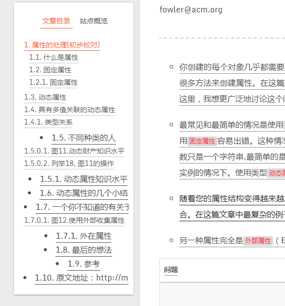

# hexo-next-demo
# How to reproduce the problem?
1. `hexo g`
2. `hexo s`
3. Visit the http://localhost:4000/113017/dealing-with-properties/
4. View the left menu

### I am not sure what's the problem.Hexo? NexT? 

# result

Try to add `align = "center"` to `###`. So , I use the `h3` tag. This led to parsing errors.
